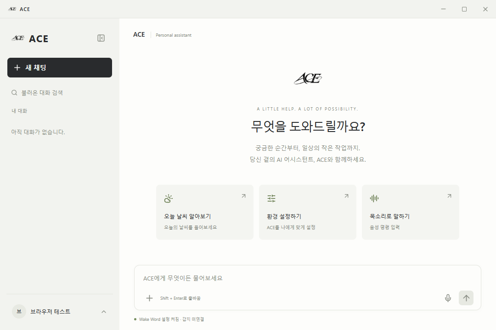

# ACE Desktop — React·Tauri 기반 AI 에이전트 데스크톱 앱

**ACE(Auto Computer Executor)**는 대화를 통해 정보를 조회하고 승인된 PC 작업을 요청하는 데스크톱 앱입니다. React가 인증·채팅·설정 화면을, Tauri와 Rust가 창·트레이·로컬 실행을 담당하며 [ACE Backend](https://github.com/AI-AGENT-ACE/ace-backend)의 NestJS API와 연결합니다.

## 주요 기능

- 회원가입·로그인·로그아웃, 세션 확인과 Access Token 재발급
- 첫 메시지 전송 시 대화방 생성, 제목 변경·고정·검색
- 대화 20개·메시지 30개 단위 페이지 조회와 이전 메시지 스크롤 위치 유지
- Markdown 표시, 중복 제출 방지, 요청 오류·재시도 표시
- 휴지통 이동·복구·영구 삭제
- 프로필 메뉴의 설정·휴지통, 화면 테마와 3가지 도구 권한 선택
- TXT·MD·CSV·JSON 파일 내용을 대화에 첨부
- AI 서버 연결 시 Agent 대화와 Cloud/Local Tool 결과 전달
- 커스텀 타이틀바, 사이드바 전환, 투명 ACE 아이콘, 트레이 숨김·복원
- 트레이의 음성 호출·Wake Word 상태·설정 진입·실제 종료 제어
- 별도 음성 명령 창과 승인 후 메모장·계산기 실행/종료 요청

## 사용 기술

| 영역     | 기술                                          |
| -------- | --------------------------------------------- |
| 화면     | React 19, TypeScript 6, Vite 8                |
| API      | Axios, 단일 Client와 기능별 API 모듈          |
| 상태     | React state·Custom Hook·AbortController       |
| 데스크톱 | Tauri 2, Rust 2021 Edition, Windows API       |
| 표시     | Lucide, react-markdown, remark-gfm            |
| 검증     | Playwright, Prettier, TypeScript, Rust 테스트 |

JavaScript 의존성은 `package-lock.json`, Rust 의존성은 `src-tauri/Cargo.lock`으로 관리합니다. TanStack Query와 Redis는 사용하지 않습니다.

## 실행 환경

- Node.js **22.12 이상**과 npm
- Windows 데스크톱 기준으로 검증한 프로젝트
- Tauri 실행 시 Rust stable, Microsoft C++ Build Tools의 데스크톱 C++ 개발 도구, WebView2 필요
- 실제 기능 사용 시 실행 중인 ACE Backend와 PostgreSQL 필요
- 브라우저에서는 화면·API를 사용할 수 있으며 창 제어·PC 명령은 Tauri 앱에서 사용

## 설치 및 실행 방법

### 1. 두 저장소 준비

백엔드와 데스크톱을 같은 상위 폴더에 clone합니다. 이 구조는 통합 테스트에도 사용합니다.

```powershell
git clone https://github.com/AI-AGENT-ACE/ace-backend.git
git clone https://github.com/AI-AGENT-ACE/ace-desktop.git
cd ace-desktop
npm ci
Copy-Item .env.example .env
```

이미 `.env`가 있으면 기존 파일을 유지합니다. 백엔드는 [백엔드 README](https://github.com/AI-AGENT-ACE/ace-backend#readme)의 PostgreSQL 설정·실행 절차를 먼저 진행합니다.

### 2. API 주소 설정

프론트 `.env`에는 공개 가능한 API 주소만 지정합니다. JWT Secret·외부 서비스 API Key는 백엔드에만 설정합니다.

```dotenv
VITE_API_BASE_URL=http://127.0.0.1:3001
```

기본 백엔드는 `http://127.0.0.1:3001`, 프론트 개발 서버는 `http://localhost:1420`입니다. 전역 `/api` 경로는 사용하지 않습니다.

### 3. 실행

```powershell
# 브라우저 미리보기
npm run dev
```

데스크톱 앱을 실행할 때는 위 개발 서버를 종료하고 다음 명령을 실행합니다. Tauri가 프론트 개발 서버도 시작합니다.

```powershell
npm run tauri dev
```

회원가입 또는 로그인 후 사용합니다. Windows PowerShell 실행 정책 오류가 나면 `npm.cmd`를 사용합니다.

### 4. 빌드

```powershell
# 프론트 빌드
npm run build
# 데스크톱 배포 파일 생성
npm run tauri build
```

운영 API 주소는 빌드 환경 또는 `.env.production`의 `VITE_API_BASE_URL`로 지정합니다. `scripts/tauri.mjs`가 API Origin을 Tauri CSP에 반영합니다. 백엔드 CORS에도 앱 Origin을 등록하며 환경변수 변경 후에는 재시작·재빌드합니다.

## 사용 방법

| 입력·메뉴                     | 동작                                                 |
| ----------------------------- | ---------------------------------------------------- |
| 새 채팅                       | 빈 작성 화면 열기; 첫 메시지를 보내면 목록에 방 생성 |
| Enter / Shift + Enter         | 메시지 전송 / 줄바꿈                                 |
| 입력창 + → 파일 추가          | 텍스트 파일 선택; 파일 옆 X로 첨부 취소              |
| 대화 목록 ⋯                   | 제목 변경·고정·휴지통 이동                           |
| 왼쪽 하단 프로필              | 설정·휴지통 열기                                     |
| 설정 → 화면 테마              | 다크·라이트 모드 선택                                |
| 설정 → 권한 설정하기          | 항상 허용 / 확인 / 항상 확인 선택                    |
| 타이틀바 드래그 / 더블클릭    | 창 이동 / 최대화·복원                                |
| 타이틀바 X / Alt + F4         | 창 숨김; 백그라운드 프로세스 유지                    |
| 트레이 ACE 열기 / ACE 종료    | 창 복원 / 앱 완전 종료                               |
| 트레이 음성 호출 / ACE 숨기기 | 기존 Orb 호출 / main 창만 숨기기                     |
| 트레이 Wake Word / 설정       | 런타임 선호 상태 변경 / main 설정 열기               |

최소화와 최대화·복원은 창 API를 즉시 호출합니다. 테마는 300ms, 사이드바는 250ms 전환을 사용하고 동작 줄이기 설정을 따릅니다.

## 프로젝트 구조

```text
src/
├── api/                  단일 Axios Client·인증·기능별 API
├── hooks/                커서 조회·중복 요청 방지·요청 취소
├── features/
│   ├── auth/             인증 상태 훅·레이아웃·폼
│   ├── chat/             메시지 목록·입력·파일 추가
│   ├── settings/         계정 설정·권한 선택
│   ├── trash/            휴지통 모달
│   ├── voice/            음성 명령 화면
│   └── system-actions/   로컬 실행 정책·어댑터
├── layouts/              타이틀바·사이드바·프로필 메뉴
├── lib/                  창 제어 어댑터
├── styles/               테마·화면·전환 스타일
├── types/                API·화면 공통 타입
└── App.tsx               기능 조합과 대화 흐름
src-tauri/
├── src/                  Rust IPC·트레이·음성 창·실행 정책
├── capabilities/         창별 API 권한
├── icons/                ACE 아이콘 리소스
└── tauri.conf.json       창·CSP·번들 설정
scripts/                  Tauri 실행·CSP 설정
tests/                    브라우저 통합 테스트
docs/                     설계·원인 분석·구현 기록
```

## 스크린샷

기본 1080×720 메인 화면입니다. 브라우저 테스트 계정 화면이며 개인 계정 정보는 포함하지 않습니다.



## 구현 의도

- API 통신, 목록 상태, 기능 UI와 네이티브 실행 책임을 분리해 기능 확장을 쉽게 합니다.
- 늦은 응답·중복 전송·병렬 토큰 갱신을 처리해 화면과 서버 데이터의 불일치를 줄입니다.
- 서버는 인증·소유권을 검사하고 Rust는 로컬 명령·호출 창·승인·인자를 다시 검증합니다.
- 음성 입력·실행 결과는 일시 전달하고 로그에는 실행 메타데이터만 저장합니다.

## 검증

```powershell
npm run build
npm run format:check
npm run test:e2e
# DB 없이 인증 UI만 검사
npm run test:auth
# 네이티브 정책과 작업표시줄 검사
cd src-tauri
cargo test --offline
```

전체 E2E에는 형제 폴더 `ace-backend`의 의존성·빌드, 실행 중인 PostgreSQL, 백엔드 `.env`의 별도 `TEST_DATABASE_URL`이 필요합니다. DB 이름은 `_test`로 끝나야 합니다. 테스트 서버는 3002, 프론트는 1430을 사용하며 실제 API·DB를 검사하고 외부 AI는 테스트 어댑터로 대체합니다. 인증 오류 테스트는 HTTP 응답을 대체합니다. 기본 브라우저는 Windows Edge이며 다른 실행 파일은 `PLAYWRIGHT_BROWSER_PATH`로 지정합니다.

최근 검증: 데스크톱 빌드, 브라우저 E2E **26개**, Rust 테스트 **5개** 통과.

## 현재 상태와 남은 작업

인증·대화·메시지·휴지통·설정의 실제 API 연결과 창·트레이 동작은 구현했습니다.

- **AI·날씨:** 백엔드 `AI_SERVER_URL`과 실제 AI 서버, `WEATHER_API_KEY`가 필요합니다. AI 미설정 시 사용자 메시지만 저장하며 날씨 카드도 질문 전송 진입점입니다.
- **음성:** STT·마이크·Wake Word 감지·TTS 출력은 미연결입니다. 음성 창에 시스템 상태 조회·메모장/계산기 실행·종료를 직접 입력해 실행 흐름을 사용할 수 있습니다.
- **파일:** TXT·MD·CSV·JSON의 UTF-8 내용만 지원합니다. 64KB·15,000자 이하, 전체 메시지 20,000자 이하이며 이미지·PDF·바이너리 업로드 API는 없습니다.
- **제목:** 기본 `새 대화`이며 수동 변경합니다. AI 자동 제목 생성은 미구현입니다.
- **세션:** sessionStorage를 사용하므로 새로고침·트레이 복원에서는 유지되지만 앱 완전 종료 후에는 다시 로그인합니다.
- **로컬 실행:** 시스템 상태 조회와 승인된 메모장·계산기 실행/종료만 지원합니다. 임의 앱·파일·Shell 명령은 차단합니다.
- **배포:** Windows 기준 검증이며 다른 OS와 운영 배포 검증은 별도 작업입니다.

## 관련 문서

- [전체 구현 단계·Rust·Tauri 설정](docs/IMPLEMENTATION_STAGES.md)
- [인증 UI와 세션 흐름](docs/AUTH_UI_AND_FLOW.md)
- [React ↔ NestJS API 연결](docs/API_CONNECTION.md)
- [창 전환·트레이](docs/UI_TRANSITIONS.md)
- [작업표시줄·트레이 아이콘](docs/APP_ICONS.md)
- [트레이 메뉴·음성 진입·Wake Word 상태](docs/TRAY_FEATURES.md)

`.env`, node_modules, 빌드 결과, Rust target, 테스트 출력과 개인 키는 Git에서 제외합니다. `.env.example`과 lock 파일은 포함합니다.

## 라이선스

현재 저장소에는 별도 라이선스가 선언되어 있지 않습니다. 재사용·배포 범위는 프로젝트 소유자에게 확인해 주세요.
